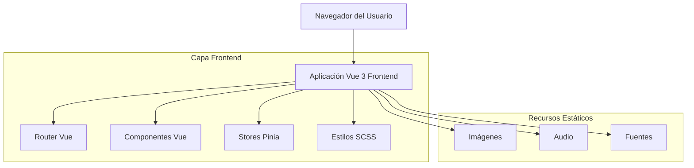
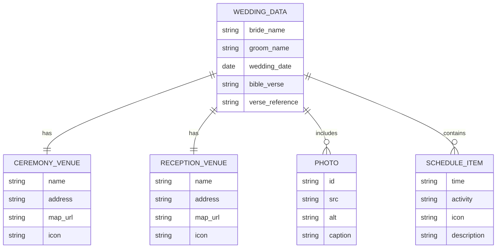

# Documento de Arquitectura Técnica - Invitación de Boda Digital

## 1. Diseño de Arquitectura



## 2. Descripción de Tecnologías

- Frontend: Vue\@3 + TypeScript + Vite + SCSS

- Gestión de Estado: Pinia

- Enrutamiento: Vue Router

- Estilos: SCSS con variables modulares

- Animaciones: CSS Transitions + Vue Transition

- Backend: Ninguno (aplicación estática)

## 3. Definiciones de Rutas

| Ruta        | Propósito                                  |
| ----------- | ------------------------------------------ |
| /           | Página principal, redirige a la invitación |
| /invitation | Vista principal de la invitación de boda   |

## 4. Estructura de Componentes

### 4.1 Componentes Principales

**InvitationView\.vue** - Vista principal que orquesta todos los componentes

```typescript
// Estructura del componente principal
interface InvitationState {
  isEnvelopeOpen: boolean
  isMusicPlaying: boolean
  currentSection: string
}
```

**EnvelopeComponent.vue** - Sobre animado inicial

```typescript
interface EnvelopeProps {
  isOpen: boolean
}

interface EnvelopeEmits {
  open: () => void
}
```

**WeddingHeaderComponent.vue** - Encabezado con nombres y cita bíblica

```typescript
interface WeddingHeaderProps {
  bride: string
  groom: string
  bibleVerse: string
  verseReference: string
}
```

**CountdownComponent.vue** - Contador regresivo

```typescript
interface CountdownProps {
  weddingDate: Date
}

interface CountdownState {
  days: number
  hours: number
  minutes: number
  seconds: number
}
```

**PhotoGalleryComponent.vue** - Galería de fotos

```typescript
interface Photo {
  id: string
  src: string
  alt: string
  caption?: string
}

interface PhotoGalleryProps {
  photos: Photo[]
}
```

**CeremonyDetailsComponent.vue** - Detalles de ceremonia y recepción

```typescript
interface Venue {
  name: string
  address: string
  mapUrl: string
  icon: string
}

interface CeremonyDetailsProps {
  ceremony: Venue
  reception: Venue
}
```

**ScheduleComponent.vue** - Itinerario de actividades

```typescript
interface ScheduleItem {
  time: string
  activity: string
  icon: string
  description?: string
}

interface ScheduleProps {
  schedule: ScheduleItem[]
}
```

**AudioPlayerComponent.vue** - Reproductor de música

```typescript
interface AudioPlayerProps {
  audioSrc: string
  autoplay: boolean
}

interface AudioPlayerState {
  isPlaying: boolean
  isLoaded: boolean
  showControls: boolean
}
```

## 5. Arquitectura del Servidor

No aplica - Aplicación frontend estática desplegada en CDN/hosting estático.

## 6. Modelo de Datos

### 6.1 Definición del Modelo de Datos



### 6.2 Definición de Datos

**Datos de la Boda**

```typescript
// Interfaz principal de datos
interface WeddingData {
  bride: string
  groom: string
  weddingDate: Date
  bibleVerse: string
  verseReference: string
  ceremony: Venue
  reception: Venue
  photos: Photo[]
  schedule: ScheduleItem[]
  musicSrc: string
}

// Datos iniciales hardcodeados
const weddingData: WeddingData = {
  bride: 'Génesis',
  groom: 'Christopher',
  weddingDate: new Date('2025-11-01'),
  bibleVerse:
    'Ya no son dos, sino uno solo. Por tanto, lo que Dios ha unido, que no lo separe el hombre',
  verseReference: 'Mateo 19:6',
  ceremony: {
    name: 'Iglesia San Gabriel de la Dolorosa',
    address: 'Kennedy Norte, Víctor Hugo Sicouret',
    mapUrl: '#',
    icon: 'church',
  },
  reception: {
    name: 'Edificio Las Cámaras',
    address: 'Av. Francisco de Orellana y Miguel H. Alcívar',
    mapUrl: '#',
    icon: 'reception',
  },
  photos: [
    // Array de fotos basado en las imágenes proporcionadas
  ],
  schedule: [
    { time: '5:00 PM', activity: 'Ceremonia Religiosa', icon: 'ceremony' },
    { time: '6:00 PM', activity: 'Sesión de Fotos', icon: 'camera' },
    { time: '7:30 PM', activity: 'Primer Baile', icon: 'dance' },
    { time: '8:30 PM', activity: 'Brindis', icon: 'toast' },
    { time: '10:00 PM', activity: 'Cena', icon: 'dinner' },
    { time: '11:30 PM', activity: 'Pastel', icon: 'cake' },
    { time: '7:00 AM', activity: 'Hasta que el cuerpo aguante', icon: 'party' },
  ],
  musicSrc: '../../src/assets/song/Hijos-del-Amanecer.mp3',
}
```

**Configuración de Estilos SCSS**

```scss
// Variables ya definidas en el proyecto
$cream-white: #fefff6;
$dark-teal: #445d57;
$dusty-rose: #b49082;
$warm-brown: #a37c40;

// Fuentes ya configuradas
$font-principal: 'Playfair Display', serif;
$font-secondary: 'Lora', serif;
$font-accent: 'Cormorant Garamond', serif;
$font-special: 'Crimson Text', serif;

// Mixins para animaciones
@mixin envelope-animation {
  transition: transform 0.8s cubic-bezier(0.4, 0, 0.2, 1);
  transform-style: preserve-3d;
}

@mixin fade-in-animation {
  animation: fadeIn 0.6s ease-in-out;
}

@keyframes fadeIn {
  from {
    opacity: 0;
    transform: translateY(20px);
  }
  to {
    opacity: 1;
    transform: translateY(0);
  }
}
```
