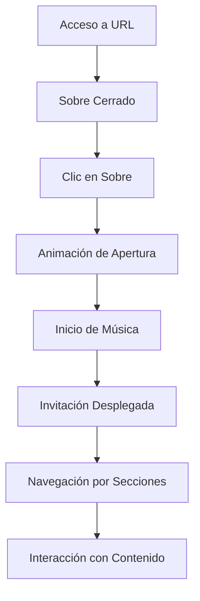

# Documento de Requerimientos del Producto - Invitación de Boda Digital

## 1. Visión General del Producto

Invitación de boda digital interactiva para Génesis y Christopher, que presenta una experiencia inmersiva comenzando con un sobre cerrado que se abre para revelar los detalles completos de la boda. La aplicación combina elegancia visual, interactividad suave y funcionalidad multimedia para crear una experiencia memorable para los invitados.

El producto resuelve la necesidad de crear invitaciones de boda modernas, ecológicas y altamente personalizables que puedan ser compartidas fácilmente y proporcionen toda la información necesaria de manera atractiva.

## 2. Características Principales

### 2.1 Roles de Usuario

| Rol | Método de Acceso | Permisos Principales |
|-----|------------------|----------------------|
| Invitado | Acceso directo por URL | Puede ver la invitación, reproducir música, navegar por todas las secciones |

### 2.2 Módulo de Características

Nuestra invitación de boda digital consiste en las siguientes páginas principales:

1. **Vista Principal de Invitación**: sobre cerrado inicial, transición animada, contenido completo de la invitación
2. **Componentes Modulares**: encabezado, contador, galería, detalles, itinerario, reproductor de audio

### 2.3 Detalles de Página

| Nombre de Página | Nombre del Módulo | Descripción de Características |
|------------------|-------------------|--------------------------------|
| Vista Principal | Componente de Sobre | Mostrar sobre cerrado inicial, animar apertura al hacer clic, revelar contenido completo |
| Vista Principal | Componente de Encabezado | Mostrar nombres de los novios (Génesis y Christopher), cita bíblica de Mateo 19:6, elementos decorativos florales |
| Vista Principal | Componente de Contador | Mostrar cuenta regresiva hasta el 1 de noviembre de 2025, formato días:horas:minutos:segundos |
| Vista Principal | Componente de Galería | Mostrar fotos de la pareja en diseño de mosaico, navegación suave entre imágenes |
| Vista Principal | Componente de Detalles | Mostrar información de ceremonia (Iglesia San Gabriel de la Dolorosa) y recepción (Edificio Las Cámaras), botones de ubicación |
| Vista Principal | Componente de Itinerario | Mostrar cronograma de actividades del día de la boda con iconos y horarios |
| Vista Principal | Componente de Audio | Reproducir música automáticamente al abrir sobre, controles discretos, botón de pausa/reproducción |

## 3. Proceso Principal

Flujo principal del usuario:
1. El usuario accede a la URL de la invitación
2. Ve un sobre cerrado elegante en pantalla
3. Hace clic en el sobre para abrirlo
4. Se reproduce música automáticamente
5. La invitación se despliega con animación suave
6. Puede navegar por todas las secciones: encabezado, contador, galería, detalles, itinerario
7. Puede controlar la reproducción de música si lo desea
8. Puede acceder a ubicaciones mediante botones de mapa

## 4. Diseño de Interfaz de Usuario

### 4.1 Estilo de Diseño

- **Colores primarios y secundarios**: 
  - Primario: #445d57 (dark-teal)
  - Secundario: #b49082 (dusty-rose)
  - Acento: #a37c40 (warm-brown)
  - Fondo: #fefff6 (cream-white)
- **Estilo de botones**: Redondeados con sombras suaves, colores de la paleta principal
- **Fuentes y tamaños preferidos**: 
  - Principal: 'Playfair Display' para títulos
  - Secundaria: 'Lora' para texto de cuerpo
  - Acento: 'Cormorant Garamond' para elementos románticos
  - Especial: 'Crimson Text' para citas bíblicas
- **Estilo de diseño**: Elegante y romántico con elementos florales, diseño centrado, uso de tarjetas
- **Sugerencias de emojis/iconos**: Elementos florales, corazones discretos, iconos de iglesia, copas de brindis, anillos

### 4.2 Resumen de Diseño de Página

| Nombre de Página | Nombre del Módulo | Elementos de UI |
|------------------|-------------------|----------------|
| Vista Principal | Componente de Sobre | Sobre 3D con sombras, animación de apertura tipo flip, colores cream-white y dark-teal |
| Vista Principal | Componente de Encabezado | Tipografía Playfair Display para nombres, elementos florales en esquinas, cita bíblica en Crimson Text |
| Vista Principal | Componente de Contador | Números grandes en Playfair Display, etiquetas en Lora, fondo dusty-rose suave |
| Vista Principal | Componente de Galería | Grid responsivo, overlay suave, transiciones fade, bordes redondeados |
| Vista Principal | Componente de Detalles | Tarjetas con iconos, botones warm-brown, tipografía Cormorant Garamond |
| Vista Principal | Componente de Itinerario | Timeline vertical, iconos temáticos, colores alternados de la paleta |
| Vista Principal | Componente de Audio | Controles minimalistas, botón flotante, indicador visual discreto |

### 4.3 Responsividad

Diseño mobile-first con adaptación completa para desktop. Optimización táctil para dispositivos móviles, navegación por gestos, y ajuste automático de tipografía y espaciado según el tamaño de pantalla.